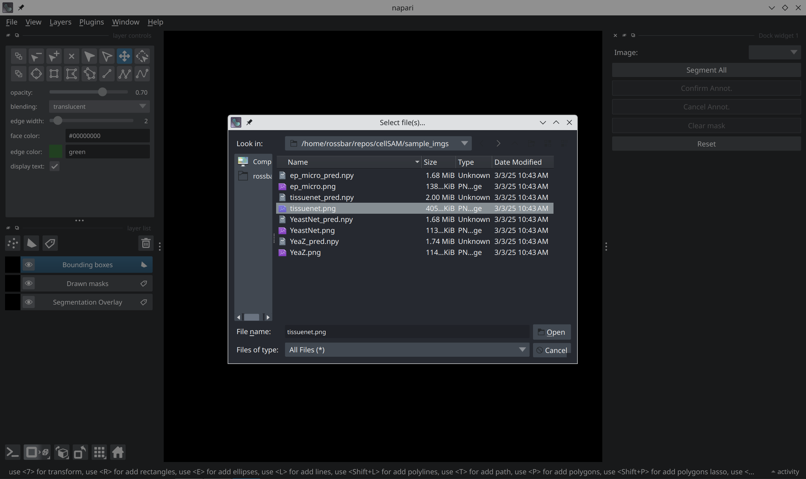
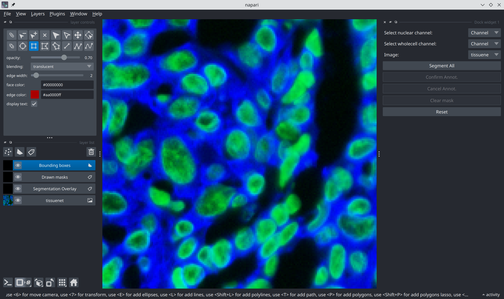
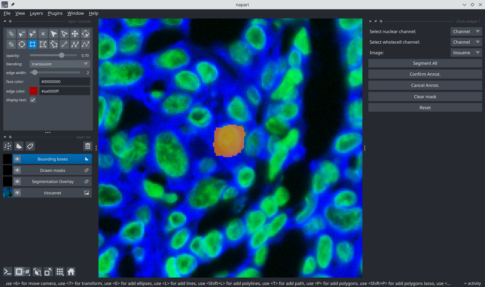

---
jupytext:
  text_representation:
    extension: .md
    format_name: myst
    format_version: 0.13
    jupytext_version: 1.16.7
kernelspec:
  display_name: Python 3 (ipykernel)
  language: python
  name: python3
---

# Napari Plugin

CellSAM includes a ``napari`` plugin to aid in local, interactive segmentation
of images.

## Installation

The plugin requires ``napari`` to be installed.
The simplest way to do so is to install the optional napari dependencies when
installing ``cellSAM``.
For instance, if installing from source in a locally-cloned repo:

```bash
pip install .[napari]
```

Or, to install all necessary dependencies without interacting with the source
code:

```bash
pip install "cellSAM[napari] @ git+https://github.com/vanvalenlab/cellSAM@master"
```

````{note}
The optional dependencies include PyQt6 by default. If you'd like finer-grained
control over which Qt bindings to use, consider installing dependencies manually,
e.g.:

```bash
pip install napari pyside2 magicgui
```

See the [napari documentation][napari-install] for details regarding Qt backends.
````

[napari-install]: https://napari.org/stable/tutorials/fundamentals/installation.html#choosing-a-different-qt-backend

## Running the plugin

Open a napari window with the cellSAM plugin:

```bash
cellsam napari
```

### Load an image

Use the `File` menu in the upper-right corner and select `Open File(s)` to
open the loading prompt.
From here, you can select the image you'd like to load --- for example,
the `tissuenet.png` from the ``sample_imgs/`` directory in the source repo:



```{note}
The plugin currently supports common image formats like `.png`. Need support for
an additional format? [Make a feature request!][gh-issues]
```

[gh-issues]: https://github.com/vanvalenlab/cellSAM/issues

### Interactive segmentation

The plugin allows users to specify bounding boxes which prompt the CellSAM
model to segment the cell inside the bounding box.

```{note}
The plugin assumes that there is one cell per bounding box. To perform
segmentation over many cells in an image region, consider the 
{func}`~cellSAM.cellsam_pipeline.cellsam_pipeline` library interface.
```

Bounding boxes are drawn by:

1. Select the "Bounding Boxes" layer on the left panel.
2. Select the "Add Rectangle" option from the tool panel in the upper left corner:

   

3. Now, select a region corresponding to a cell you'd like to segment:

   

4. Finally, press the "Confirm Annot." button on the right panel. This will
   prompt the model to predict the segmentation mask for the highlighted cell.

   

This process can be repeated to segment multiple cells.
The segmented cells will be visible on the main canvas and are captured in the
`Segmentation Overlay` layer.

### Clearing the results

Individual predictions can be removed using the standard napari labeling tools
in the `Segmentation Overlay` layer.
The `Clear mask` button on the right panel can be used to remove all predictions
from the current session (i.e. clear the segmentation mask).
The `Reset` button removes both the current predictions *and* the underlying
image and should only be used if you'd like to open a new image in the existing
session.

## Segmenting the entire image

The napari plugin also provides a `Segment All` button on the right panel which
can be used to automatically segment all cells in the image.

```{caution}
The napari plugin is primarily designed for interactive segmentation.
The `Segment All` button is not recommended if:
 - The image is greater than 2k x 2k pixels.
 - You do not have a GPU locally available.
The {func}`~cellSAM.cellsam_pipeline.cellsam_pipeline` library interface is
recommended for segmenting entire images.
```
